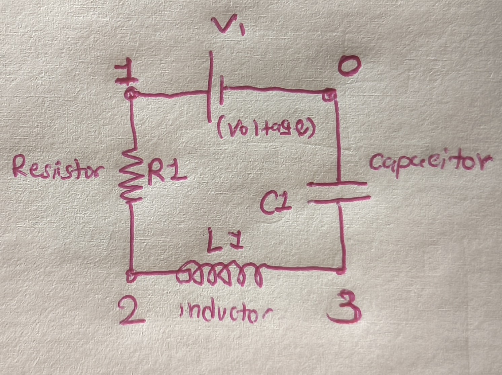

# MiniSpice Circuit Simulator

A command-line circuit simulator for resistor, inductor, capacitor, and
voltage-source circuits. It calculates a DC operating point and an
AC frequency sweep, prints the results, and exports them as CSV files.

## Requirements

- A C++ compiler with C++17 support (`g++`)
- GNU Make (`make` on Linux/macOS; `mingw32-make` with MinGW on Windows)

## Build

From the project directory, run:

```sh
mingw32-make
```

On Linux or macOS, use `make` instead. The default target builds the simulator
and both test programs: `circuit_simulator`, `tests`, and `csv_tests`.

## Run

Run the simulator without a CSV argument to use its built-in example circuit:

```sh
mingw32-make run
```

The built-in example is a series RLC circuit: a 5 V voltage source, a 100 Ω
resistor, a 10 mH inductor, and a 1 μF capacitor. The simulator runs DC
operating-point analysis and an AC sweep from 500 Hz to 3000 Hz in 250 Hz
steps.



You can also provide a circuit CSV file directly:

```sh
./circuit_simulator path/to/circuit.csv
```

On Windows, use `.\circuit_simulator.exe path\to\circuit.csv`. The program
prints the components, DC node voltages, and AC sweep results. It writes
`dc_results.csv` and `ac_results.csv` to the current directory, replacing those
output files if they already exist.

## Circuit CSV format

The input file must have this header:

```csv
type,name,node_a,node_b,value
```

Each following row describes one component. Supported types are:

- `V` — independent voltage source; `value` is volts
- `R` — resistor; `value` is ohms
- `L` — inductor; `value` is henries
- `C` — capacitor; `value` is farads

Node `0` is ground. For example:

```csv
type,name,node_a,node_b,value
V,V1,1,0,5
R,R1,1,2,100
L,L1,2,3,0.01
C,C1,3,0,0.000001
```

The simulator validates the input and reports the file and row for CSV errors.
Numeric values should be written directly (for example, `0.01`, not `10m`).

## Tests

Build the test programs with the default build, then run them:

```sh
./tests
./csv_tests
```

On Windows:

```sh
.\tests.exe
.\csv_tests.exe
```

## Clean

Remove generated object files and executables with:

```sh
mingw32-make clean
```

Use `make clean` on Linux/macOS.
